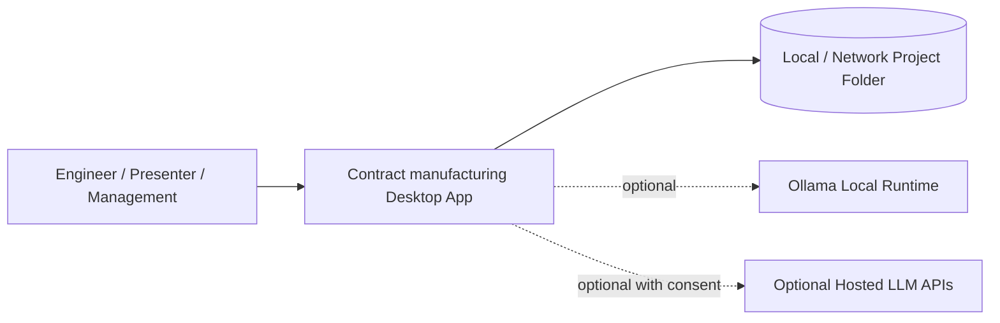
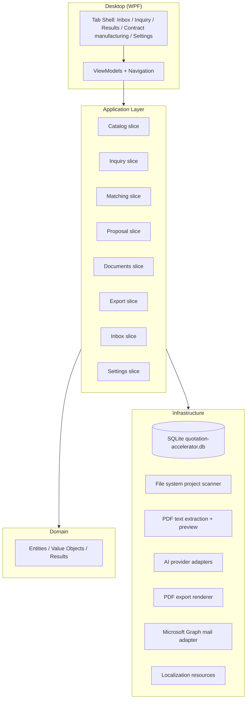
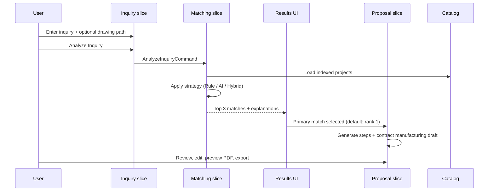
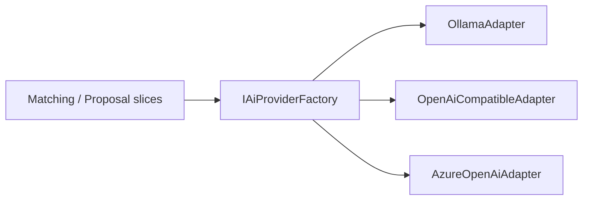

# Architecture

## Overview

**Contract manufacturing** is a portable Windows desktop prototype that helps engineering staff identify and reuse historical manufacturing project knowledge during technical review and contract manufacturing preparation.

Handbook version: **v1.3.1** (pinned in `ai/project-context.md`).

Requirements: `docs/requirements.md` (approved for implementation planning).

The solution answers: **"Have we manufactured something similar before?"** It runs entirely on a local Windows machine, references documents in place on a file share, and ships as a portable self-contained ZIP release.

---

## Architecture Style

| Decision | Choice | Reference |
|----------|--------|-----------|
| Style | Modular Monolith (single process) | Heckel ADR-009 |
| Organisation | Vertical slices per business capability | Heckel ADR-010, project ADR-004 |
| Layering | Domain → Application → Presentation; Infrastructure via interfaces | Heckel ADR-011 |
| Deployment | Portable desktop — no server, no microservices | `docs/requirements.md` NFR-001, NFR-003 |

Microservices, message brokers, and cloud hosting are out of scope for the pilot.

---

## System Context



---

## Container View



---

## Modules

| Module | Responsibility | Key dependencies |
|--------|----------------|------------------|
| **Desktop** | WPF host, tab navigation, views, view models, dialogs | Application slices |
| **Catalog** | Discover projects, parse `metadata.json`, index documents, rescan | File system, SQLite |
| **Inquiry** | Capture and validate inquiry input, drawing file reference | FluentValidation |
| **Matching** | Rule-based, AI-assisted, and hybrid similarity search; rank top 3 | Catalog, Documents, AI adapters |
| **Proposal** | Generate and edit manufacturing steps and contract manufacturing draft from primary match | Matching, Documents, AI adapters |
| **Documents** | List referenced files, open folder/file, embedded PDF preview | File system, PDF preview |
| **Export** | Clipboard copy, contract manufacturing PDF export | Proposal, Inquiry, Matching |
| **Inbox** | Fetch mailbox, categorize emails, support queue, inquiry prefill, outbound replies | Microsoft Graph, SQLite, Inquiry |
| **Settings** | Project root, language, matching strategy, AI providers, mail account, status card, debug logging | Catalog, AI adapters, Inbox, persistence |
| **Infrastructure** | SQLite, configuration, Ollama/OpenAI/Azure OpenAI clients, PDF libraries | External runtimes |

Slices communicate through the internal dispatcher (commands/queries) per Heckel ADR-002. Slices do not reference each other's infrastructure implementations directly.

---

## Layering

Per Heckel ADR-011:

| Layer | Location | Rules |
|-------|----------|-------|
| **Presentation** | `src/Desktop/` | Views, view models, navigation, UI localization bindings. No business rules. |
| **Application** | `src/{Slice}/Application/` | Commands, queries, handlers, validators, orchestration. Uses interfaces for infrastructure. |
| **Domain** | `src/{Slice}/Domain/` or `src/SharedKernel/` | Entities, value objects, result types, domain services without I/O. |
| **Infrastructure** | `src/Infrastructure/` | SQLite, file I/O, AI HTTP clients, PDF extraction/preview/export implementations. |

---

## Primary User Flow (Architecture)



---

## Technology Decisions

| Area | Choice | ADR / Reference |
|------|--------|-----------------|
| Runtime | **.NET 10 LTS** (confirm from official support policy at scaffold) | Heckel ADR-013 |
| Shell | **WPF** on Windows 10/11 | Project ADR-001 |
| UI pattern | MVVM (`CommunityToolkit.Mvvm`) | Project ADR-001 |
| Persistence | **SQLite** (`quotation-accelerator.db` in app folder) | Project ADR-002, Heckel ADR-012 |
| Configuration | `appsettings.json` colocated with executable | `docs/requirements.md` NFR-012 |
| Validation | FluentValidation | Heckel ADR-003 |
| Mapping | Mapster (non-trivial DTO mapping) | Heckel ADR-001 |
| Dispatcher | Internal command/query dispatcher | Heckel ADR-002 |
| Logging | `ILogger<T>` | Heckel ADR-005 |
| PDF preview | **WebView2** embedded viewer | Project ADR-001 |
| PDF text extraction | PdfPig (or equivalent) for indexing and AI-assisted matching | Project ADR-004 |
| PDF export | QuestPDF (or equivalent) for Contract manufacturing draft export | Project ADR-004 |
| Localization | RESX + `Microsoft.Extensions.Localization` | `docs/requirements.md` FR-019 |
| AI chat / completion | Abstracted `IChatCompletionService` | Heckel ADR-006, project ADR-003 |
| AI embeddings | Abstracted `IEmbeddingService`; Ollama-first | Heckel ADR-006, project ADR-003 |
| Vector storage | SQLite table or derived index rebuilt on rescan | Project ADR-004 |
| Authentication | None (pilot) | `docs/requirements.md` NFR-007 |
| Hosting | Portable ZIP — no cloud | `docs/requirements.md` NFR-003 |

---

## Solution Layout

```text
QuotationAccelerator.sln
src/
  Desktop/                      # WPF host, tabs, views, view models
  Catalog/
    Application/
    Domain/
  Inquiry/
    Application/
    Domain/
  Matching/
    Application/
    Domain/
  Proposal/
    Application/
    Domain/
  Documents/
    Application/
    Domain/
  Export/
    Application/
    Domain/
  Settings/
    Application/
    Domain/
  Infrastructure/
    Persistence/
    FileSystem/
    Ai/
    Pdf/
  SharedKernel/                 # Shared result types, enums, primitives
tests/
  Catalog.UnitTests/
  Inquiry.UnitTests/
  Matching.UnitTests/
  Proposal.UnitTests/
  Architecture.Tests/
sample-data/                    # Bundled demonstration projects
docs/
adrs/
```

---

## Matching Engine

Three strategies are pluggable behind a common `IMatchingStrategy` interface (project ADR-004).

| Strategy | Pipeline |
|----------|----------|
| **Rule-based** | Score projects from `metadata.json` and filenames (material, surface, processes, quantity, keywords). Always available. |
| **AI-assisted** | Extract text from inquiry drawing and project PDFs; rank using embeddings and/or LLM comparison. |
| **Hybrid** | Rule-based pre-filter → embedding similarity if available → else LLM ranking → else rule-based ranking only. Always selectable. |

Default configuration: **Hybrid + Ollama + qwen3:8b + nomic-embed-text** (`docs/requirements.md`).

Similarity explanations and generated proposal text are produced in the active UI language (German default).

---

## Data Architecture

### Project files (source of truth)

Historical knowledge remains on disk. The application never writes back to project folders.

```text
{ProjectRoot}/
  PRJ-2019-0142_Stainless-Enclosure/
    metadata.json
    Drawing.pdf
    Offer.pdf
    ...
```

### Local application data (portable)

| Artifact | Purpose |
|----------|---------|
| `appsettings.json` | Non-secret defaults; overridden by user settings in SQLite where appropriate |
| `quotation-accelerator.db` | User settings, catalog index, extracted text cache, embedding vectors |
| `logs/` (optional) | Debug logs when enabled — technical metadata only |

On **Rescan Projects** or project root change, the catalog index is rebuilt. Embedding vectors may be regenerated lazily or during rescan.

---

## External Integrations

| System | Purpose | Protocol | Required |
|--------|---------|----------|----------|
| Local file system / SMB share | Project folders and PDF documents | File I/O | Yes |
| Ollama | Local chat + embedding models | HTTP (`localhost`) | Optional (preferred) |
| OpenAI-compatible API | Hosted chat / embeddings | HTTPS | Optional |
| Azure OpenAI | Hosted chat / embeddings | HTTPS | Optional |
| Microsoft 365 (Graph) | Inbox fetch, send replies | HTTPS + Entra OAuth | Optional (Inbox workflow) |
| OS default PDF handler | Open document externally | Shell execute | Optional fallback |

ERP integration is out of scope for the pilot. Email integration is optional until the user configures a mailbox in **Settings** (FR-020).

---

## AI Architecture

Per Heckel ADR-006, ADR-014, ADR-015 and project ADR-003:



**Privacy gates**

- Default: no document or inquiry text leaves the machine.
- Hosted providers require disclosure + explicit user confirmation before first request.
- API keys stored in local user settings / SQLite — never in repository.

**Settings status card** surfaces availability of rule-based matching, Ollama, embedding model, Azure OpenAI, and OpenAI API key (FR-018).

---

## Presentation Architecture

Four primary tabs map to view models and navigation regions:

| Tab | View responsibility |
|-----|---------------------|
| **Inquiry** | Form fields, drawing picker, Analyze action |
| **Results** | Heading "Top 3 Similar Projects", scores, explanations, primary match selection |
| **Contract manufacturing** | Single scrollable page with collapsible sections |
| **Settings** | Project root, AI config, language, status card, rescan |

---

## Health and Observability

HTTP health endpoints (`/health/live`, `/health/ready`) are **not applicable** — this is a desktop application, not a deployable web service.

| Signal | Pilot approach |
|--------|----------------|
| Logs | Optional debug logging to app folder (NFR-006) |
| Metrics | Not required |
| Tracing | Not required |
| Alerts | Not required |

See `docs/operations.md` for portable deployment and troubleshooting.

---

## Security Summary

| Topic | Approach |
|-------|----------|
| Authentication | None for pilot |
| Secrets | API keys via Settings; not committed; optional Windows credential store in future |
| Data residency | Local-first; hosted AI only after consent |
| GDPR | Privacy-by-default, synthetic sample data in repo |

Details: `docs/security.md`.

---

## Risk Assessment

| Risk | Likelihood | Impact | Mitigation |
|------|------------|--------|------------|
| Ollama not installed on demo laptop | Medium | Medium | Rule-based default; Settings guidance; status card |
| Poor match quality in live demo | Medium | High | Bundled `sample-data`; tuned rule weights; hybrid fallback |
| Accidental external data transmission | Low | High | Consent gate; local-first defaults; clear status card |
| PDF extraction quality varies | Medium | Medium | Prefer `metadata.json`; cache extracted text; graceful degradation |
| Network share latency / offline paths | Medium | Low | Index locally in SQLite; async rescan with progress |
| WPF WebView2 runtime missing | Low | Medium | Document WebView2 prerequisite in README; fallback to external open |

---

## Cost Estimation

| Item | Pilot expectation |
|------|-------------------|
| Cloud hosting | None |
| Azure OpenAI / OpenAI | Optional; user-provided keys; demo caution |
| Ollama | Free local runtime |
| CI | Standard GitHub Actions build for Windows x64 |

---

## Related Documents

| Document | Purpose |
|----------|---------|
| `docs/requirements.md` | Functional and non-functional requirements |
| `docs/security.md` | Security and AI data handling |
| `docs/operations.md` | Portable deployment and support |
| `adrs/` | Project-specific architecture decisions |
| Heckel `adrs/ADR-002` – `ADR-015` | Platform standards |

---

## Document History

| Version | Date | Change |
|---------|------|--------|
| 0.1 | 2026-06-21 | Initial architecture from approved requirements |
